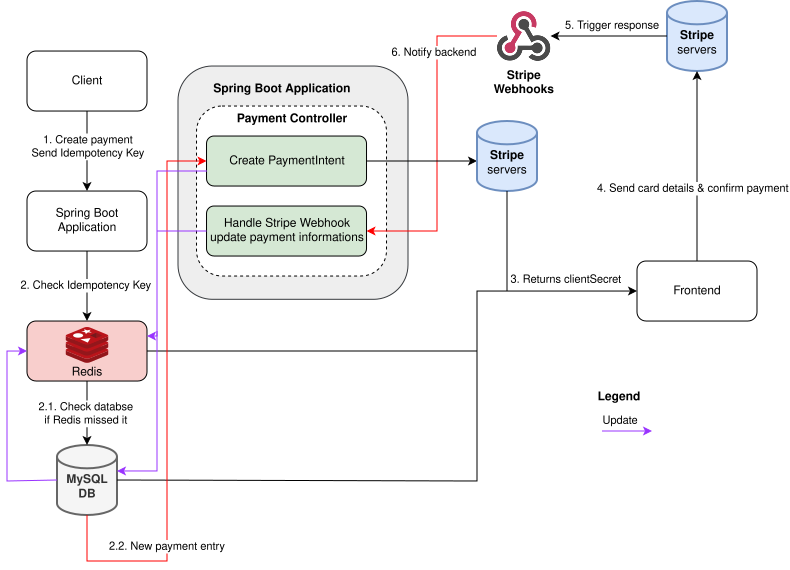

# Descrierea proiectului

Aplicatia este un magazin online de jocuri video digitale, cu scopul de a fi cat mai profitabil pentru dezvoltatori si cat mai avantajos pentru clienti.
Aplicatia se adreseaza atat dezvoltatorilor carora li se pare prea mare procentajul cerut de magazinele consacrate per vanzare, cat si pentru jucatorii care cauta jocuri la preturi reduse prin pachete promotionale. 
De asemenea, utilizatorii pot alege sa redirectioneze o parte din suma achitata unei cauze caritabile.

# Roluri
Aplicatia contine mai multe roluri:
- Admin: asigura bunul mers al aplicatiei
- Developer: dezvolta jocuri care pot fi listate pe platforma Bundle Forge
- Fondator de organizatie caritabila: colaboreaza cu platforma Bundle Forge pentru a primi un procent din vanzari
- Customer: cumpara jocuri de pe plaforma Bundle Forge

# Functionalitati principale
- Crearea unor pachete promotionale pentru achizitionarea jocurilor la preturi reduse, spre exemplu o lista de 20 de jocuri de la diversi dezvoltatori, cu optiunile de a cumpara 3 jocuri la 10 RON sau 5 jocuri la 15 RON. 
- Oferirea unor coduri de reducere, de exemplu unul de 5% per utilizator dupa fiecare achizitie sau de unul de 10% la general, pentru promotia de vara. 
- Optiunea jucatorilor de a alege procentajele pentru platforma, dezvoltatori si caritate pentru fiecare pachet promotional, conform procentelor minime stabilite in contract. 

# Arhitectura aplicatiei


# Diagrama Entitate-Relatie


# Setup

## 1. Prerequisites
- [Docker](https://docs.docker.com/get-docker/) and Docker Compose
- A [Stripe](https://stripe.com) account (for payment processing)

## 2. Create a `.env` file from [.env.example](.env.example) and fill it in

| Variable | Description |
|---|---|
| `MYSQL_ROOT_PASSWORD` | Root password for the MySQL container |
| `DB_PASS` | Password for the application database user |
| `JWT_SECRET` | Base64-encoded secret used to sign JWTs (min 32 bytes) |
| `STRIPE_API_KEY` | Stripe secret key (`sk_test_...`) from the Stripe Dashboard |
| `STRIPE_WEBHOOK_SECRET` | Webhook signing secret (`whsec_...`) — see step 3 |
| `VITE_STRIPE_PUBLISHABLE_KEY` | Stripe publishable key (`pk_test_...`) from the Stripe Dashboard |
| `APP_CORS_ALLOWED_ORIGINS` | Origin(s) the backend accepts (default: `http://localhost:5173`) |

## 3. Stripe webhook secret

### Option A — automatic (recommended)
Leave `STRIPE_WEBHOOK_SECRET` empty in `.env` and start the stack with `--profile stripe` (see step 4).
The `stripe-cli` container authenticates with `STRIPE_API_KEY`, prints the signing secret, and injects it into the backend automatically.

### Option B — manual
Run the Stripe CLI locally, copy the printed `whsec_...` value into `.env`, then start the stack normally:
```sh\
stripe listen — forward-to http://localhost:8080/api/payment/webhook/stripe
```

## 4. Run the stack

```sh
# With Stripe CLI (webhook forwarding + secret injection handled automatically)
docker compose --profile stripe up -d

# Without Stripe CLI (manage webhook forwarding manually)
docker compose up -d
```


## 5. Stop the stack

```sh
# Must match the profile used at startup
docker compose --profile stripe down   # if started with --profile stripe
docker compose down                    # otherwise
```

# API Documentation

**Auth legend**
- `public` — no token required
- `Customer` — JWT Bearer token, CUSTOMER role
- `Developer` — JWT Bearer token, DEVELOPER role
- `Admin` — JWT Bearer token, ADMIN role

---

## Auth — `/auth`

| Method | Path | Auth | Description |
|---|---|---|---|
| POST | `/auth/signin` | public | Sign in, returns JWT token and user type |
| POST | `/auth/signup` | public | Register a new customer account |
| POST | `/auth/request/developer` | public | Submit a developer account request |
| POST | `/auth/check-email` | public | Check if an email is already registered |
| POST | `/auth/check-displayname` | public | Check if a display name is already taken |

---

## Customers — `/customers`

| Method | Path | Auth | Description |
|---|---|---|---|
| GET | `/customers` | public | List all customers |
| GET | `/customers/me` | Customer | Get the authenticated customer's profile |
| GET | `/customers/{customerId}` | public | Get a customer by ID |
| PUT | `/customers` | Customer | Update the authenticated customer's profile |

---

## Developers — `/developers`

| Method | Path | Auth | Description |
|---|---|---|---|
| GET | `/developers` | public | List all accepted developers |
| GET | `/developers/me` | Developer | Get the authenticated developer's profile |
| GET | `/developers/{providerId}` | public | Get a developer by ID |
| PUT | `/developers` | Developer | Update the authenticated developer's profile |
| POST | `/developers/games` | Developer | Announce a new game (multipart: `game`, `cover`, `images`) |
| GET | `/developers/games` | Developer | List the authenticated developer's games (filter by `status`, `title`) |
| PUT | `/developers/games/{gameId}` | Developer | Update a game (multipart: `game`, `cover?`, `images?`) |
| DELETE | `/developers/games/{gameId}` | Developer | Delete a game |

---

## Games — `/games`

| Method | Path | Auth | Description |
|---|---|---|---|
| GET | `/games/{gameId}` | public | Get game details |
| POST | `/games/{gameId}/keys` | Developer | Upload activation keys for a game |

---

## Shop — `/shop`

| Method | Path | Auth | Description |
|---|---|---|---|
| GET | `/shop` | Customer | List all published games the customer does not own |
| GET | `/shop/{gameId}` | Customer | Get a single shop game (must not be owned) |
| POST | `/shop/{gameId}/buy` | Customer | Purchase a game directly |

---

## Library — `/library`

| Method | Path | Auth | Description |
|---|---|---|---|
| GET | `/library` | Customer | List all games owned by the authenticated customer |
| GET | `/library/{gameId}` | Customer | Get a specific owned game |

---

## Payment — `/payment`

| Method | Path | Auth | Description |
|---|---|---|---|
| POST | `/payment/create` | Customer | Create a Stripe PaymentIntent; send `Idempotency-Key` header |
| GET | `/payment/status/{paymentUuid}` | Customer | Get payment status by UUID |
| GET | `/payment/orders` | Customer | List the authenticated customer's orders |
| GET | `/payment/orders/{orderId}` | Customer | Get a specific order |
| POST | `/payment/webhook/stripe` | public* | Stripe webhook receiver (verified by `Stripe-Signature` header) |

*Not protected by JWT — Stripe's HMAC signature is the authentication mechanism.

---

## Bundles — `/bundles`

| Method | Path | Auth | Description |
|---|---|---|---|
| GET | `/bundles` | public | List all bundles |
| GET | `/bundles/{id}` | public | Get a bundle by ID |
| POST | `/bundles` | Admin | Create a bundle (multipart: `bundle`, `cover`) |
| PUT | `/bundles/{id}` | Admin | Update a bundle (multipart: `bundle`, `cover?`) |
| DELETE | `/bundles/{id}` | Admin | Delete a bundle |

---

## Search — `/search`

| Method | Path | Auth | Description |
|---|---|---|---|
| GET | `/search` | public | Search games and bundles |

Query params: `q`, `type`, `tagIds`, `developer`, `platforms`, `page` (default 0), `size` (default 24), `sort` (default `newest`)

---

## Tags — `/tags`

| Method | Path | Auth | Description |
|---|---|---|---|
| GET | `/tags` | public | List all tags |
| POST | `/tags` | public | Create a new tag (`{ "name": "..." }`) |

---

## Coupons — `/coupons`

| Method | Path | Auth | Description |
|---|---|---|---|
| GET | `/coupons/{code}` | public | Validate a coupon code |
| GET | `/coupons/my` | Customer | List coupons available to the authenticated customer |

---

## Charity Founders — `/charity-founders`

| Method | Path | Auth | Description |
|---|---|---|---|
| GET | `/charity-founders` | public | List all charity founders |
| GET | `/charity-founders/{id}` | public | Get a charity founder by ID |
| POST | `/charity-founders` | Admin | Create a charity founder |
| PUT | `/charity-founders/{id}` | Admin | Update a charity founder |
| DELETE | `/charity-founders/{id}` | Admin | Delete a charity founder |

---

## Featured — `/featured`

| Method | Path | Auth | Description |
|---|---|---|---|
| GET | `/featured` | public | Get featured slides for the home page |

---

## Top Sellers — `/top-sellers`

| Method | Path | Auth | Description |
|---|---|---|---|
| GET | `/top-sellers` | public | Get top-selling games (filter via `filter` param: `ALL`, `WEEK`, `MONTH`) |

---

## Admin — `/admin`

| Method | Path | Auth | Description |
|---|---|---|---|
| GET | `/admin/providers` | Admin | List provider accounts (filter by `status`, `name`) |
| PUT | `/admin/providers/{providerId}` | Admin | Approve or reject a provider account |


# Screenshots


# Contributii
## Mihalache Sebastian-Stefan
- Payment System - integrare Stripe + Redis
- Frontend Game/Bundle + Store + Checkout
- Spring Security - JWT Authentication
- Testing
- Docker configuration

## Neculae Andrei-Fabian
- Backend + Frontend Operatii CRUD
- Frontend Sign-in
- Configurare Multi-Environment
- Logging
- Paginare si Sortare
- Testing